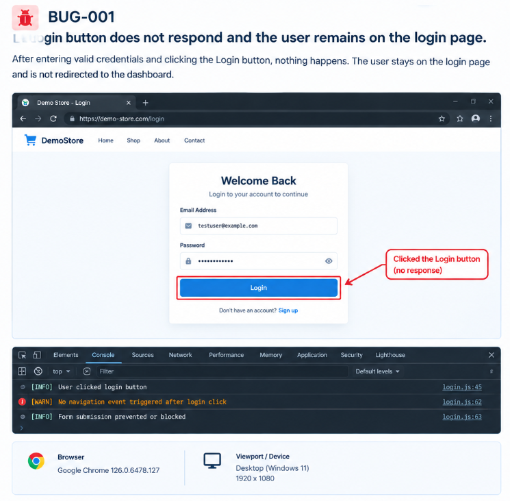

# BUG-001 — Login Button Does Not Respond

**Status:** Open  
**Severity:** High  
**Priority:** High  
**Type:** Functional  
**Environment:** Chrome / Windows desktop

## Steps to Reproduce

1. Open the demo login page.
2. Enter a valid email address.
3. Enter a valid password.
4. Click **Login**.

## Expected Result
The user should be authenticated and redirected to the dashboard.

## Actual Result
The Login button does not respond and the user remains on the login page.

## Reproducibility
5/5 attempts.

## Evidence
See 

## Suggested Investigation
Check the click handler, form submission event, client-side validation state, and network request triggered after clicking Login.
